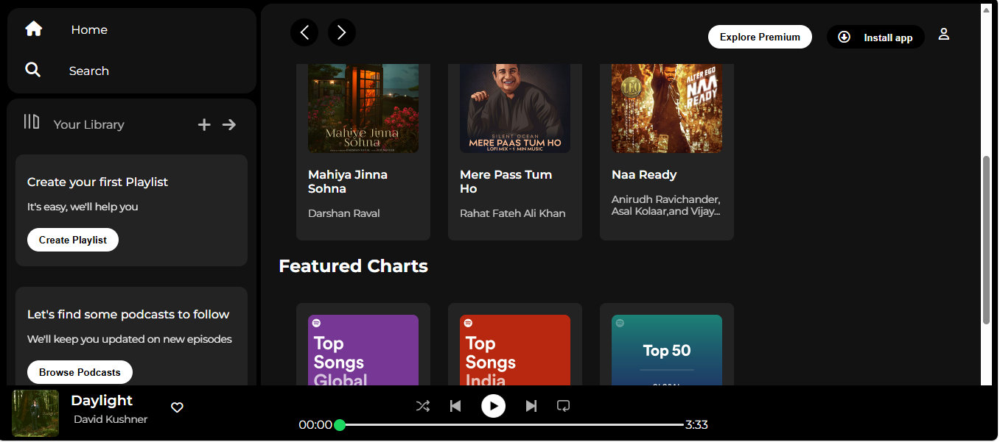

# Spotify-Clone 
A front-end clone of Spotify's web player interface, built to practice HTML and CSS fundamentals — layout, responsive design, and UI replication of a real-world product.

## Live Demo
Live deployment link removed due to Safe Browsing false-positive on branded UI clones - see screenshot for a full preview

## Screenshots


## Features
- Sidebar navigation (Home, Search, Your Library)
- "Create your first Playlist" and "Browse Podcasts" panels
- Horizontally scrollable album/playlist cards with cover art, title, and artist
- "Featured Charts" section with colored gradient cards (Top Songs Global, Top Songs India, Top 50)
- Sticky bottom now-playing bar with:
  - Track thumbnail, title, and artist
  - Playback controls (shuffle, previous, play/pause, next, repeat)
  - Progress bar with elapsed/total time
  - Like (heart) button
- Top navbar with back/forward navigation, "Explore Premium," "Install App," and profile icon
- Dark theme matching Spotify's UI
- Sticky top navigation bar that stays visible while scrolling content
- Fixed bottom player bar, pinned regardless of scroll position
- Custom-styled progress bar (native range input restyled with `::-webkit-slider-thumb`)
- Responsive breakpoints that adapt the UI on smaller screens (hides secondary controls under 1000px, collapses sidebar under 800px)

## Tech Stack
- HTML5
- CSS3 (Flexbox, custom range input styling, media queries)
- [Font Awesome](https://fontawesome.com/) for icons
- [Google Fonts](https://fonts.google.com/) (Montserrat)

## What I Learned
- Using `position: sticky` and `position: fixed` to keep the top nav and bottom player bar in place while scrolling
- Structuring flexible layouts with Flexbox (`flex-wrap` for card grids, nested flex containers for the player controls)
- Styling a native `<input type="range">` element from scratch, including the track and thumb, using `::-webkit-slider-runnable-track` and `::-webkit-slider-thumb`
- Using `rem` units consistently for more scalable, readable sizing
- Adapting layouts for smaller screens with media queries — hiding secondary UI elements and collapsing the sidebar at set breakpoints

## Challenges I Faced
- Styling the progress/playback slider was the trickiest part — native range inputs have very limited default styling, so getting the track color, thumb size, and green accent color to match Spotify's design took custom pseudo-element CSS
- Getting the sticky top bar and fixed bottom player to both stay correctly positioned without overlapping scrollable content
- Balancing a fully fluid responsive redesign vs. a simpler breakpoint-based approach — I chose to hide non-essential elements (like the sidebar and secondary buttons) at smaller widths rather than fully restructuring the layout

## How to Run Locally
1. Clone the repository
   ```bash
   git clone https://github.com/Pal-b7/spotify-clone.git
   ```
2. Navigate into the project folder
   ```bash
   cd Spotify-Clone
   ```
3. Open `index.html` in your browser (or use the VS Code Live Server extension)

## Folder Structure
```
Spotify-Clone/
├── index.html
├── style.css
├── assets/
│   ├── logo.png
│   ├── library_icon.png
│   ├── backward_icon.png / forward_icon.png
│   ├── player_icon1-5.png
│   ├── card1-6img.jpeg
│   |── Daylight.png
|   |__ screenshot.png
└── README.md
```

## Acknowledgements
This project was built as a learning exercise to practice front-end development. UI design inspired by Spotify's official web player. Not affiliated with or endorsed by Spotify.

## License
This project is for educational purposes only.